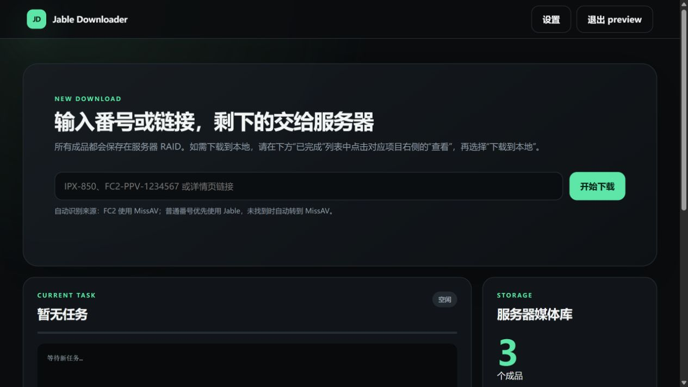

# Jable + MissAV Downloader

带登录保护的 Jable / MissAV 自动下载面板：输入番号或详情页链接，服务器完成来源识别、HLS 捕获、下载合并与 JAV / FC2 分类归档，同时保留全局命令 `n`。

[](https://github.com/TonyStarkJr2021/jable-downloader-cli/releases/latest)
[](https://github.com/TonyStarkJr2021/jable-downloader-cli/actions/workflows/ci.yml)
[](LICENSE)
[](https://www.python.org/)

[下载最新版](https://github.com/TonyStarkJr2021/jable-downloader-cli/releases/latest) · [一键安装](#一键安装) · [一键更新](#一键更新) · [使用说明](#使用) · [Jellyfin 迁移](#从-v211-迁移现有媒体与-jellyfin)



> 仅用于你有权访问和下载的内容。本项目不绕过 DRM、付费墙、验证码或访问控制。

## v2.2.0

- 普通 JAV 自动归档到 `media/JAV`，FC2 自动归档到 `media/FC2`。
- Web 媒体库递归显示分类和已有成品，并继续兼容升级前的根目录文件。
- v2.1.1 升级时只补齐配置和创建目录，不自动移动、覆盖或删除现有媒体。
- 更新前备份应用与配置；Web 账号、端口、Chromium profile、Jellyfin 和 MetaTube 部署保持不变。

## 工作流程

```text
番号或详情页
    │
    ├── 普通 JAV：Jable 优先，MissAV 回退
    └── FC2：MissAV
            │
            ▼
     捕获公开 HLS / M3U8
            │
            ▼
 N_m3u8DL-RE + FFmpeg 合并
            │
            ├── media/JAV
            └── media/FC2
```

## 功能

- 浏览器访问 `http://服务器IP:端口`，用户名和密码登录
- 首次安装自动生成随机可用端口、随机用户名和强密码
- 输入 `IPX-850`、`ipx850`、`FC2-PPV-1234567` 或详情页链接，自动标准化并查重
- 自动识别来源：FC2 使用 MissAV；普通番号优先使用 Jable，未找到时转到 MissAV
- 实时查看任务状态和运行日志，同一时间只运行一个下载任务
- 自动分类归档：普通 JAV 写入 `media/JAV`，FC2 写入 `media/FC2`
- 递归浏览服务器媒体库，兼容升级前仍位于 `media` 根目录的成品
- 后台设置可视化修改登录用户名、密码和 Web 端口
- 浏览器下载支持 HTTP Range，可暂停或续传；只复制到本地，不删除服务器原文件
- Jable 使用 headed Chromium + Xvfb + Playwright + 持久 profile，优先捕获 `mushroomtrack.com`
- MissAV 优先安全解析公开播放器数据，页面结构变化时自动改用 Chromium，优先选择 `surrit.com`
- MissAV 流量通过仅监听 `127.0.0.1` 的临时 HLS 转发层下载，任务结束即关闭
- N_m3u8DL-RE + FFmpeg，固定启用 `--use-ffmpeg-concat-demuxer`
- `ulimit -n 65535`，已通过 1972、2295 分片长视频验证
- 保留 CLI：`n`、`n IPX-850`、`n ipx850`、`n "IPX 850"`

## 支持系统

| 系统 | 状态 |
|---|---|
| Debian 12/13、Ubuntu 22.04/24.04 | 正式支持 |
| Fedora、Arch Linux、openSUSE Tumbleweed | 正式支持 |
| CentOS Stream 9/10、Rocky Linux、AlmaLinux、RHEL 8–10 | 尽力支持 |
| openSUSE Leap | 尽力支持 |
| CentOS Linux 7/8 | EOL 兼容支持，需要额外参数 |
| Alpine Linux | CLI 实验支持；无 systemd 时不启用 Web 服务 |

支持 `x86_64` 和 `aarch64/arm64`。Web 服务需要 systemd；安装器在没有运行 systemd 的环境中会保留 CLI 并跳过 Web。

## 一键安装

root 用户：

```bash
bash <(curl -fsSL https://raw.githubusercontent.com/TonyStarkJr2021/jable-downloader-cli/main/install.sh)
```

普通 sudo 用户：

```bash
curl -fsSL https://raw.githubusercontent.com/TonyStarkJr2021/jable-downloader-cli/main/install.sh | sudo bash
```

安装结束后终端会显示 Web 地址、随机用户名和首次密码。首次密码只显示这一次，配置文件只保存 scrypt 哈希，请立即保存。

### 自定义端口和账号

```bash
bash <(curl -fsSL https://raw.githubusercontent.com/TonyStarkJr2021/jable-downloader-cli/main/install.sh) \
  --web-port 27891 \
  --web-user admin \
  --web-password '请替换为至少12位的强密码'
```

端口必须在 `1024–65535` 之间。安装器会检查端口冲突，但不会自动修改防火墙。

### 自定义数据目录

默认数据根目录是 `/mnt/raid_hdd/AV`。如需改为其他服务器目录：

```bash
bash <(curl -fsSL https://raw.githubusercontent.com/TonyStarkJr2021/jable-downloader-cli/main/install.sh) --data-root /data/AV
```

### CentOS 7/8

CentOS Linux 7 和 8 已停止维护。必须明确允许安装器备份现有 repo 并使用 Vault/EPEL 归档源：

```bash
bash <(curl -fsSL https://raw.githubusercontent.com/TonyStarkJr2021/jable-downloader-cli/main/install.sh) --enable-eol-repos
```

归档源和旧版 Chromium 可能随上游变化而失效；生产环境更建议 Rocky Linux、AlmaLinux 或 Debian。

## 登录与端口放行

浏览器打开安装结果中的地址，例如 `http://203.0.113.10:27891`。

如果服务器防火墙阻止连接，请只放行实际生成的 TCP 端口：

```bash
# Ubuntu / Debian（启用了 UFW 时）
sudo ufw allow 27891/tcp

# CentOS / Rocky / AlmaLinux（启用了 firewalld 时）
sudo firewall-cmd --permanent --add-port=27891/tcp
sudo firewall-cmd --reload
```

云服务器还需要在服务商安全组中放行同一端口。不要把示例端口照搬为实际端口。

默认是明文 HTTP，不建议直接暴露到公网。公网使用请限制来源 IP，或在 Nginx/Caddy/Cloudflare Tunnel 后配置 HTTPS；启用 HTTPS 后可将 `/etc/jable-downloader/web.json` 的 `secure_cookie` 改为 `true` 并重启服务。

## 使用

在 Web 首页输入番号或详情页链接并开始任务，例如：

```text
IPX-850
FC2-PPV-1234567
https://jable.tv/videos/ipx-850/
https://missav.ai/en/fc2-ppv-1234567
```

自动识别规则：

- FC2 番号直接使用 MissAV；
- 普通番号先搜索 Jable，未找到时自动转到 MissAV；
- 详情页链接按域名直接选择 Jable 或 MissAV；
- 不支持其他网站链接，也不会请求链接中指定的任意服务器。

下载完成后：

- 普通 JAV 保存在 `media/JAV`，FC2 保存在 `media/FC2`；
- 点击“下载到本地”，由浏览器按自身下载设置选择电脑保存位置；
- 本地下载是复制，服务器文件不会被移动或删除；
- 如果同番号已存在，任务会快速结束，可直接从媒体库下载现有文件。

CLI 仍可使用：

```bash
n IPX-850
n ipx850
n "IPX 850"
n FC2-PPV-1234567
n fc2ppv1234567
n "FC2 PPV 1234567"
n https://missav.ai/en/fc2-ppv-1234567
n
```

## 后台设置

登录后点击页面右上角“设置”，可以：

- 修改登录用户名；
- 设置新的登录密码；
- 修改 Web 访问端口。

修改账号或端口都必须验证当前密码。修改端口前，请先在 VPS 防火墙和云服务器安全组中放行新的 TCP 端口；保存后 Web 服务会自动重启。下载任务运行期间不能更换端口，避免中断下载。

## 一键更新

从 v1.x 首次升级到 v2.0.0 时，请使用下面的 GitHub 远程命令；不要先运行 VPS 中尚未更新的旧版 `/opt/jable-downloader/update.sh`：

```bash
bash <(curl -fsSL https://raw.githubusercontent.com/TonyStarkJr2021/jable-downloader-cli/main/update.sh)
```

完成一次 v2 升级后，后续版本也可以运行 `sudo /opt/jable-downloader/update.sh`。更新会保留 Web 账号、端口、下载配置、Chromium profile 和全部媒体；旧程序与更新前配置备份在 `/opt/jable-downloader/backups/`。

从 v2.1.1 升级到 v2.2.0 时，更新器会自动补充 `jav_media_dir`、`fc2_media_dir` 并创建分类目录，但不会自动移动任何现有媒体。旧文件仍会被查重和 Web 面板识别；确认迁移方案后再按下节操作。

## 从 v2.1.1 迁移现有媒体与 Jellyfin

目标结构：

```text
/mnt/raid_hdd/AV/media/
├── JAV/
│   └── 普通 JAV 视频、同名封面和 NFO
└── FC2/
    └── FC2-PPV-* 视频、同名封面和 NFO
```

先更新下载器。更新完成后，新任务已经会进入分类目录，现有文件仍停留原处：

```bash
sudo /opt/jable-downloader/update.sh
```

先查看根目录待迁移内容，不会改动文件：

```bash
find /mnt/raid_hdd/AV/media -mindepth 1 -maxdepth 1 \
  ! -name JAV ! -name FC2 -printf '%f\n' | sort
```

确认清单后，暂停下载任务并分类移动。脚本遇到同名目标会停止，不会覆盖；FC2 的视频、封面、字幕和 NFO 只要以相同番号开头都会一起进入 FC2：

```bash
sudo systemctl stop jable-downloader-web
sudo bash <<'EOF'
set -Eeuo pipefail
MEDIA_ROOT=/mnt/raid_hdd/AV/media
mkdir -p "$MEDIA_ROOT/JAV" "$MEDIA_ROOT/FC2"
shopt -s nullglob nocasematch dotglob

destination_for() {
  case "$1" in
    FC2-PPV-*|FC2PPV-*|FC2-*) printf '%s\n' "$MEDIA_ROOT/FC2" ;;
    *) printf '%s\n' "$MEDIA_ROOT/JAV" ;;
  esac
}

# 先检查所有目标，发现同名文件时不开始迁移。
for source in "$MEDIA_ROOT"/*; do
  name=${source##*/}
  [[ "$name" == JAV || "$name" == FC2 ]] && continue
  destination=$(destination_for "$name")
  target="$destination/$name"
  [[ ! -e "$target" ]] || { echo "目标已存在，停止：$target" >&2; exit 1; }
done

for source in "$MEDIA_ROOT"/*; do
  name=${source##*/}
  [[ "$name" == JAV || "$name" == FC2 ]] && continue
  destination=$(destination_for "$name")
  mv -- "$source" "$destination/"
done
EOF
sudo systemctl start jable-downloader-web
```

如果命令因同名目标停止，预检阶段不会移动任何文件；先人工核对提示的源文件与目标文件，再重新执行。不要使用强制覆盖参数。

Jellyfin/MetaTube 不需要改 Docker Compose，继续保留宿主机映射：

```text
/mnt/raid_hdd/AV/media  →  /media
```

只在 Jellyfin 控制台调整媒体库：

1. 打开“控制台 → 媒体库”，编辑现有 JAV 库，将文件夹从 `/media` 改为 `/media/JAV`。
2. 新建独立的 FC2 电影库，文件夹选择 `/media/FC2`。
3. 两个库均保留 MetaTube 为元数据和图片提供器；不要再把父目录 `/media` 加入任何库，否则会重复收录。
4. 保存后分别扫描 JAV 与 FC2 库。确认条目和播放正常，再清理 Jellyfin 中可能残留的旧路径条目。

这套迁移只移动媒体文件并修改 Jellyfin 的扫描路径，不会触碰 Jellyfin 配置、MetaTube Server、PostgreSQL、Docker 卷、挂载点或 `update-media`。如果 FC2 Provider 暂时不可用，分类目录和现有手工元数据仍会保留；以后 Provider 恢复后只需对 FC2 库刷新元数据。

## 一键卸载

保留配置、Chromium profile 和全部媒体：

```bash
bash <(curl -fsSL https://raw.githubusercontent.com/TonyStarkJr2021/jable-downloader-cli/main/uninstall.sh)
```

同时清除账号配置和 Chromium profile：

```bash
bash <(curl -fsSL https://raw.githubusercontent.com/TonyStarkJr2021/jable-downloader-cli/main/uninstall.sh) --purge
```

CentOS 7/8 恢复安装前 repo：

```bash
bash <(curl -fsSL https://raw.githubusercontent.com/TonyStarkJr2021/jable-downloader-cli/main/uninstall.sh) --restore-repos
```

卸载始终保留 `work`、`downloads`、`media/JAV`、`media/FC2` 及其中的媒体文件，也不会改动 qBittorrent、MoviePilot、Jellyfin、MetaTube、Docker、挂载点或防火墙。

## 服务与配置

```bash
sudo systemctl status jable-downloader-web
sudo journalctl -u jable-downloader-web -f
sudo systemctl restart jable-downloader-web
```

| 路径 | 用途 |
|---|---|
| `/opt/jable-downloader/` | 程序、Web 和管理脚本 |
| `/etc/jable-downloader/config.json` | 下载配置 |
| `/etc/jable-downloader/web.json` | Web 端口、用户名和密码哈希 |
| `/var/lib/jable-downloader/` | Chromium profile |
| `/usr/local/bin/n` | 全局 CLI 命令 |
| `/mnt/raid_hdd/AV/work` | 临时分片 |
| `/mnt/raid_hdd/AV/downloads` | 合并后的待归档文件 |
| `/mnt/raid_hdd/AV/media` | 媒体根目录及旧版未分类成品 |
| `/mnt/raid_hdd/AV/media/JAV` | 普通 JAV 正式成品 |
| `/mnt/raid_hdd/AV/media/FC2` | FC2 正式成品 |

分类目录可在 `/etc/jable-downloader/config.json` 中通过 `jav_media_dir` 和 `fc2_media_dir` 单独覆盖。`media_dir` 继续作为 Web 媒体浏览与旧版兼容的共同根目录；若把分类目录设到根目录之外，Jable CLI 仍可归档和查重，但 Web 面板不会显示根目录之外的文件。

## 常见问题

### 页面打不开

先运行 `systemctl status jable-downloader-web`，再确认服务器防火墙和云安全组已放行安装结果中的端口。

### 搜索返回 403 或停在验证页

MissAV 会先尝试读取公开播放器数据，失败后才改用持久 Chromium profile；Jable 仍直接使用 Chromium。保留 profile 后重试。站点策略可能变化，本项目不提供绕过验证码或访问控制的功能。

### MissAV 捕获成功但分片返回 403

保持 `missav_hls_relay` 为 `true`。该功能只在下载任务期间监听服务器本机的随机端口，并使用播放器捕获到的请求上下文读取公开可播放的 HLS 分片。

### 出现 Too many open files

请从 Web 面板或 `n` 启动，不要绕过入口直接调用下载器。

## 上游项目与许可证

- [N_m3u8DL-RE](https://github.com/nilaoda/N_m3u8DL-RE)
- [Playwright for Python](https://playwright.dev/python/)
- [curl-cffi](https://github.com/lexiforest/curl_cffi)
- [FastAPI](https://fastapi.tiangolo.com/)
- [FFmpeg](https://ffmpeg.org/)

本仓库代码使用 [MIT License](LICENSE)，第三方程序遵循各自许可证，详见 [NOTICE](NOTICE.md)。
