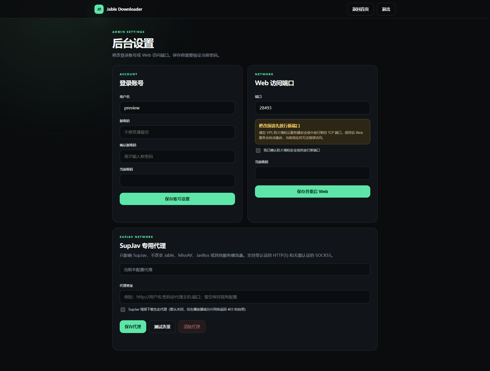

# Jable + MissAV + SupJav Downloader

带登录保护的 Jable / MissAV / SupJav 自动下载面板：输入番号或详情页链接，服务器会并行解析三个来源，按实际分辨率和码率选择最佳 HLS，并在下载失败时自动尝试其余可用直链；全部直链来源均无结果时，可在 Web 页面查看 JavBus 推荐磁链，同时保留全局命令 `n`。

[](https://github.com/TonyStarkJr2021/jable-downloader-cli/releases/latest)
[](https://github.com/TonyStarkJr2021/jable-downloader-cli/actions/workflows/ci.yml)
[](LICENSE)
[](https://www.python.org/)

[下载最新版](https://github.com/TonyStarkJr2021/jable-downloader-cli/releases/latest) · [一键安装](#一键安装) · [一键更新](#一键更新) · [使用说明](#使用) · [Jellyfin 迁移](#从-v211-迁移现有媒体与-jellyfin)



> 仅用于你有权访问和下载的内容。本项目不绕过 DRM、付费墙、验证码或访问控制。

## v2.7.5

- 修复一键更新在公开 GitHub 仓库克隆异常时进入用户名/密码提示、表现为长时间卡住的问题。
- 安装和更新的 Git 操作均强制禁用交互式凭据提示，失败时立即进入明确的回退或报错流程。
- 官方仓库无法通过 Git 克隆时自动改用 GitHub 源码压缩包，不再要求用户输入 GitHub 账号。
- 自定义仓库继续保留 Git 更新能力，但克隆失败时安全退出，不会把凭据暴露在终端或配置文件中。
- 新增安装与更新非交互认证及压缩包回退回归测试；完整测试数量增加至 98 项。

## v2.7.4

- 修复 SupJav Chromium 捕获只在外层页面点击、无法触发跨域 iframe 内真实播放器的问题。
- 每条播放器线路现在会保持加载并接受多次播放尝试，不再每次点击都重载 iframe、导致正片尚未出现就被重置。
- 支持常见 JW Player、Video.js、Plyr、原生 video 播放控件，并为无标准按钮的 iframe 提供播放器中心点击回退。
- 后台配置的播放尝试次数现在会完整执行；捕获窗口会自动覆盖播放器加载、全部尝试及最后一次 HLS 请求的等待时间。
- 多条 SupJav 线路会按尝试预算分组轮换，仍会逐条验证时长并拒绝 6 秒广告、短预览、空清单和失效清单。
- 新增跨域 iframe 播放与线路轮换回归测试，完整测试数量增加至 97 项。

## v2.7.3

- 新增 SupJav 专用广告防护层：压制 `window.open` 弹窗、关闭新页面并阻止主播放页跳转到外部广告站。
- 新增项目自维护的 `rules/supjav-adblock.json`，规则只随经过测试的项目版本更新，不在用户服务器上静默下载第三方列表。
- M3U8、媒体分片、密钥、XHR/Fetch 和播放器数据始终优先放行，广告规则异常时自动降级为基础弹窗防护，避免误伤真实下载。
- SupJav 播放器现在按配置执行有限次数的线路轮换与播放尝试，并继续使用完整时长探测过滤短广告和预览。
- 后台设置新增广告防护开关和播放尝试次数（默认 10，范围 1–30），保存后从下一个任务开始生效。
- 安装、更新、回滚备份、配置示例、CI 与 Release 附件均已纳入规则文件；升级保留现有代理、路径、账号、端口、Jellyfin 与 MetaTube 设置。
- 新增规则校验、媒体保护、随机域名导航拦截、后台保存和浏览器弹窗压制测试，完整测试数量增加至 95 项。

## v2.7.2

- SupJav 的 Chromium 回退不再捕获到第一条 M3U8 就提前结束，会在完整捕获窗口内继续检查可用播放器线路。
- 浏览器解析会自动轮换页面上的播放器服务器，并去重收集最多 12 条候选直链。
- 下载前逐条验证候选时长，自动排除短广告和预览，再按分辨率、码率与时长选择最优完整资源。
- 只有 SupJav 没有任何可用完整资源时才回退到 MissAV 等其他来源，避免把 6 秒广告误判成 SupJav 正片。
- 无需新增配置，升级时保留现有 SupJav 代理、媒体目录、Web 账号、端口、Jellyfin 与 MetaTube 设置。
- 新增短广告过滤与完整资源选择回归测试，完整测试数量增加至 87 项。

## v2.7.1

- SupJav 代理的测试、保存和清除不再重复要求后台密码；已登录会话与 CSRF 防护仍然有效。
- 修改登录账号和 Web 端口继续要求当前密码，不降低高影响设置的保护。
- 长任务日志改为同时保留开头和最新内容，来源解析、画质比较及最终选择不会再被大量 FFmpeg 警告挤掉。
- 日志超过安全上限时明确显示中间省略行数，避免无提示截断，同时防止轮询响应无限增长拖慢页面。
- 新增代理交互与日志首尾保留回归测试。

## v2.7.0

- 后台设置新增 SupJav 专用代理，支持 HTTP、HTTPS 和 SOCKS5 地址；HTTP(S) 代理支持用户名和密码。
- 默认只有 SupJav 搜索、详情页和播放器解析走代理；Jable、MissAV、JavBus 与其他下载流量保持直连。
- 可选“SupJav 视频下载也走代理”，启用后画质探测和本机 HLS 转发使用同一代理。
- 提供代理连接测试、凭据隐藏、当前密码验证和一键清除；页面与任务日志不会回显代理账号或密码。
- 安装与更新自动补齐空配置，不覆盖现有路径、账号、端口、媒体、Jellyfin 或 MetaTube 设置。
- 新增代理校验、解析范围、下载转发、Web 保存/测试/清除及升级兼容测试。

## v2.6.2

- SupJav 搜索优先使用路径式公开入口，旧查询参数入口返回 403 时自动继续尝试其余入口。
- FC2 的静态解析与 Chromium 回退统一使用 SupJav 接受的 `FC2PPV 数字` 搜索格式，同时保留规范番号作为备用。
- 并行任务中的浏览器 HTTP 日志现在带有来源名称，避免不同站点的状态码互相混淆。
- 真实验证 `START-629` 可取得三条完整 1080p HLS；`FC2-PPV-4968930` 可取得 1080p 与 480p HLS，程序会选择优于 MissAV 720p 的 SupJav 1080p 版本。
- 不增加配置项，不改变现有安装路径、媒体目录、Web 账号、端口、Jellyfin 或 MetaTube 配置。

## v2.6.1

- 修复 SupJav 播放器把 HLS 主清单伪装为 `master.txt` 时被误判为无资源的问题。
- SupJav 浏览器捕获会保存播放器请求的真实 Referer，避免解析成功后在清单或分片下载阶段再次遇到 403。
- 不再按照 TV、FST、ST、VOE 等服务器名称硬编码媒体类型；逐一检查服务器实际返回的 HLS。
- 浏览器验证页完成后，只要最终页面渲染出同站点、准确匹配番号的结果，即可继续解析；仍不会绕过验证码或访问控制。
- 保持跨站画质排序：分辨率相同时优先使用码率更高的来源，失败后继续尝试下一条候选。
- 使用 `START-629` 的真实 SupJav 播放清单验证 1080p、码率、完整时长和本机 HLS 转发，并通过 74 项自动化测试。

## v2.6.0

- 新增 SupJav 公开 HLS 来源，普通番号与 FC2 番号现在会并行解析 Jable、MissAV、SupJav。
- 汇总三个来源的可用直链，并按实际分辨率、码率、时长排序后选择最佳资源。
- 当前直链下载失败时自动切换下一条候选；每条候选使用独立临时文件，避免失败分片污染后续下载。
- SupJav 支持站点使用的 FC2 搜索写法、多个播放器服务器、浏览器捕获回退和短预览过滤。
- 新增 HLS 有效性验证，不再把 404 或空 M3U8 外壳误判为可用资源。
- SupJav 下载保留播放器请求上下文，并兼容部分服务器在 MPEG-TS 分片前添加的伪装数据。
- 安装和更新脚本会为现有部署补齐 SupJav 配置，不改动原媒体目录、账号、端口及 Jellyfin / MetaTube 配置。

## v2.5.0

- 新打开 Web 页面时不再回放上一次已结束任务的番号、状态和日志；当前仍在运行或搜索磁链的任务会继续显示。
- “已完成”列表新增管理模式，可单选、全选和批量删除。
- 删除时可选择“仅从列表移除”并保留服务器文件，或“删除任务及文件”永久删除对应视频及独立番号目录内的配套文件；删除服务器文件前会再次明确展示两种处理方式。
- 被移出列表的项目记录保存在 `/var/lib/jable-downloader/hidden-media.json`，升级与重启后仍然生效。
- 服务器媒体库计数文案由“个成品”调整为“部作品”，并继续统计服务器上实际存在的视频。

## v2.4.1

- 修复升级后浏览器继续使用旧版前端脚本，导致任务已找到 JavBus 磁链但推荐区域不显示的问题。
- CSS 与 JavaScript 地址包含当前版本号；以后升级后会自动加载对应版本，不需要手动清理浏览器缓存。
- 找到 JavBus 候选磁链后，页面自动定位到推荐区域。

## v2.4.0

- 支持 `300MIUM-1483`、`300mium1483`、`1PONDO-123456` 等数字与字母混合前缀的番号，同时继续拒绝纯数字和不安全字符。
- 同一条一键安装命令自动选择存储：检测到真实挂载的 `/mnt/raid_hdd` 时使用 `/mnt/raid_hdd/AV`，否则使用 VPS 系统盘 `/var/lib/jable-downloader-data`。
- 无需挂载硬盘，也无需为无硬盘 VPS 使用不同安装命令；安装结果会显示实际数据目录并提醒系统盘容量。
- 用户明确传入 `--data-root` 或 `JABLE_DATA_ROOT` 时始终使用指定的绝对路径。
- 更新现有部署时保留原数据目录、媒体、账号、端口、Jellyfin、MetaTube 与 JavBus 回退配置，不自动迁移文件。

## 工作流程

```text
番号或详情页
├── 普通 JAV
│   ├── 并行解析 Jable / MissAV / SupJav → 按画质排序公开 HLS / M3U8
│   │   └── N_m3u8DL-RE + FFmpeg → media/JAV/番号/番号.mp4
│   └── 三者均无直链 → JavBus 推荐磁链（手动复制）
└── FC2 → 并行解析 Jable / MissAV / SupJav → 按画质排序公开 HLS / M3U8
    └── N_m3u8DL-RE + FFmpeg → media/FC2/番号/番号.mp4
```

## 功能

- 浏览器访问 `http://服务器IP:端口`，用户名和密码登录
- 首次安装自动生成随机可用端口、随机用户名和强密码
- 输入 `IPX-850`、`300MIUM-1483`、`1PONDO-123456`、`FC2-PPV-1234567` 或详情页链接，自动标准化并查重
- 自动并行解析 Jable、MissAV、SupJav，并按实际分辨率、码率和时长排列可用直链
- 最佳直链下载失败时自动切换下一条，各候选来源使用独立临时文件，避免失败分片互相污染
- 普通番号的三个直链来源均无结果时，在 Web 页面按画质、字幕、分享日期和大小推荐 JavBus 磁链
- 磁链只供手动复制到用户自己的下载工具，项目不会自动提交或下载 BT 任务
- 实时查看任务状态和运行日志，同一时间只运行一个下载任务
- 自动分类归档：普通 JAV 写入 `media/JAV/番号`，FC2 写入 `media/FC2/番号`
- 递归浏览服务器媒体库，兼容升级前仍位于 `media` 根目录的成品
- 后台设置可视化修改登录用户名、密码和 Web 端口
- 浏览器下载支持 HTTP Range，可暂停或续传；只复制到本地，不删除服务器原文件
- Jable 使用 headed Chromium + Xvfb + Playwright + 持久 profile，优先捕获 `mushroomtrack.com`
- MissAV 优先安全解析公开播放器数据，页面结构变化时自动改用 Chromium，优先选择 `surrit.com`
- SupJav 解析公开服务器入口，过滤短预览流，并兼容部分分片前的非视频伪装数据
- MissAV 与 SupJav 流量通过仅监听 `127.0.0.1` 的临时 HLS 转发层下载，任务结束即关闭
- N_m3u8DL-RE + FFmpeg，固定启用 `--use-ffmpeg-concat-demuxer`
- `ulimit -n 65535`，已通过 1972、2295 分片长视频验证
- 保留 CLI：`n`、`n IPX-850`、`n 300MIUM-1483`、`n FC2-PPV-1234567`

## 支持系统

| 系统 | 状态 |
|---|---|
| Debian 12/13、Ubuntu 22.04/24.04 | 正式支持 |
| Fedora、Arch Linux、openSUSE Tumbleweed | 正式支持 |
| CentOS Stream 9/10、Rocky Linux、AlmaLinux、RHEL 8–10 | 尽力支持 |
| openSUSE Leap | 尽力支持 |
| CentOS Linux 7/8 | EOL 兼容支持，需要额外参数 |
| Alpine Linux | CLI 实验支持；无 systemd 时不启用 Web 服务 |

支持 `x86_64` 和 `aarch64/arm64`。Web 服务需要 systemd；安装器在没有运行 systemd 的环境中会保留 CLI 并跳过 Web。

## 一键安装

root 用户：

```bash
bash <(curl -fsSL https://raw.githubusercontent.com/TonyStarkJr2021/jable-downloader-cli/main/install.sh)
```

普通 sudo 用户：

```bash
curl -fsSL https://raw.githubusercontent.com/TonyStarkJr2021/jable-downloader-cli/main/install.sh | sudo bash
```

安装器会自动选择数据目录：如果 `/mnt/raid_hdd` 是真实挂载点，就使用 `/mnt/raid_hdd/AV`；没有挂载硬盘时自动使用 VPS 系统盘 `/var/lib/jable-downloader-data`。两种服务器使用完全相同的一键安装命令。安装结束后终端会显示实际数据目录、Web 地址、随机用户名和首次密码。首次密码只显示这一次，配置文件只保存 scrypt 哈希，请立即保存。

### 自定义端口和账号

```bash
bash <(curl -fsSL https://raw.githubusercontent.com/TonyStarkJr2021/jable-downloader-cli/main/install.sh) \
  --web-port 27891 \
  --web-user admin \
  --web-password '请替换为至少12位的强密码'
```

端口必须在 `1024–65535` 之间。安装器会检查端口冲突，但不会自动修改防火墙。

### 自定义数据目录

一般不需要指定：安装器会自动选择已挂载硬盘或系统盘。如需使用其他已经挂载的数据盘目录：

```bash
bash <(curl -fsSL https://raw.githubusercontent.com/TonyStarkJr2021/jable-downloader-cli/main/install.sh) --data-root /data/AV
```

### CentOS 7/8

CentOS Linux 7 和 8 已停止维护。必须明确允许安装器备份现有 repo 并使用 Vault/EPEL 归档源：

```bash
bash <(curl -fsSL https://raw.githubusercontent.com/TonyStarkJr2021/jable-downloader-cli/main/install.sh) --enable-eol-repos
```

归档源和旧版 Chromium 可能随上游变化而失效；生产环境更建议 Rocky Linux、AlmaLinux 或 Debian。

## 登录与端口放行

浏览器打开安装结果中的地址，例如 `http://203.0.113.10:27891`。

如果服务器防火墙阻止连接，请只放行实际生成的 TCP 端口：

```bash
# Ubuntu / Debian（启用了 UFW 时）
sudo ufw allow 27891/tcp

# CentOS / Rocky / AlmaLinux（启用了 firewalld 时）
sudo firewall-cmd --permanent --add-port=27891/tcp
sudo firewall-cmd --reload
```

云服务器还需要在服务商安全组中放行同一端口。不要把示例端口照搬为实际端口。

默认是明文 HTTP，不建议直接暴露到公网。公网使用请限制来源 IP，或在 Nginx/Caddy/Cloudflare Tunnel 后配置 HTTPS；启用 HTTPS 后可将 `/etc/jable-downloader/web.json` 的 `secure_cookie` 改为 `true` 并重启服务。

## 使用

在 Web 首页输入番号或详情页链接并开始任务，例如：

```text
IPX-850
300MIUM-1483
FC2-PPV-1234567
https://jable.tv/videos/ipx-850/
https://missav.ai/en/fc2-ppv-1234567
```

自动识别规则：

- 普通番号与 FC2 番号都会并行解析 Jable、MissAV、SupJav，并按实际画质排序；
- 下载过程中当前直链失败时，会自动换用下一条候选直链；
- 普通番号在三个直链来源均无结果时，Web 页面显示 JavBus 推荐磁链；
- Jable、MissAV 的含番号详情页链接可直接识别；SupJav 请直接输入番号，因为其详情页地址通常只有数字 ID；
- 不支持其他网站链接，也不会请求链接中指定的任意服务器。

下载完成后：

- 普通 JAV 保存在 `media/JAV/番号`，FC2 保存在 `media/FC2/番号`；
- 如果出现“找到可选磁力资源”，可复制推荐项或其他候选项到你自己的下载工具；
- 点击“下载到本地”，由浏览器按自身下载设置选择电脑保存位置；
- 本地下载是复制，服务器文件不会被移动或删除；
- 如果同番号已存在，任务会快速结束，可直接从媒体库下载现有文件。

CLI 仍可使用：

```bash
n IPX-850
n ipx850
n "IPX 850"
n 300MIUM-1483
n 300mium1483
n FC2-PPV-1234567
n fc2ppv1234567
n "FC2 PPV 1234567"
n https://missav.ai/en/fc2-ppv-1234567
n
```

## 后台设置

登录后点击页面右上角“设置”，可以：

- 修改登录用户名；
- 设置新的登录密码；
- 修改 Web 访问端口。
- 配置、测试或清除 SupJav 专用代理。

修改账号或端口必须验证当前密码。SupJav 代理的测试、保存和清除使用当前登录会话及 CSRF 校验，不再重复要求密码。修改端口前，请先在 VPS 防火墙和云服务器安全组中放行新的 TCP 端口；保存后 Web 服务会自动重启。下载任务运行期间不能更换端口，避免中断下载。代理保存后从下一个任务开始生效，无需重启服务。

## 一键更新

从 v1.x 首次升级到 v2.0.0 时，请使用下面的 GitHub 远程命令；不要先运行 VPS 中尚未更新的旧版 `/opt/jable-downloader/update.sh`：

```bash
bash <(curl -fsSL https://raw.githubusercontent.com/TonyStarkJr2021/jable-downloader-cli/main/update.sh)
```

完成一次 v2 升级后，后续版本也可以运行 `sudo /opt/jable-downloader/update.sh`。更新会保留 Web 账号、端口、下载配置、Chromium profile 和全部媒体；旧程序与更新前配置备份在 `/opt/jable-downloader/backups/`。

升级到 v2.4.x 时，更新器会保留当前数据目录、配置、账号、端口、Chromium profile 和全部媒体。自动存储选择只用于没有现有配置的新安装，不会把已有 RAID 或系统盘媒体迁移到别处；也不会修改 Jellyfin、MetaTube、Docker、挂载点或外部 `update-media` 命令。

从 v2.1.1 或 v2.2.0 升级时，更新器仍会安装安全迁移工具。新下载立即使用独立番号目录；旧的根目录或分类目录平铺文件仍可查重和浏览，按下节确认后再迁移。

## 从 v2.1.1 / v2.2.0 迁移现有媒体与 Jellyfin

目标结构：

```text
/mnt/raid_hdd/AV/media/
├── JAV/
│   └── IPX-850/
│       ├── IPX-850.mp4
│       ├── IPX-850.nfo
│       └── IPX-850-poster.jpg
└── FC2/
    └── FC2-PPV-4968748/
        ├── FC2-PPV-4968748.mp4
        ├── FC2-PPV-4968748.nfo
        └── FC2-PPV-4968748-poster.jpg
```

先更新下载器。更新完成后，新任务已经会进入分类目录，现有文件仍停留原处：

```bash
sudo /opt/jable-downloader/update.sh
```

先暂停下载任务并预览迁移计划。预览不会改动任何文件，同时会列出无法识别番号而被跳过的文件：

```bash
sudo systemctl stop jable-downloader-web
sudo /opt/jable-downloader/venv/bin/python \
  /opt/jable-downloader/migrate_media_layout.py
```

确认所有源路径与目标路径正确后，加 `--apply` 执行，再启动 Web 服务：

```bash
sudo /opt/jable-downloader/venv/bin/python \
  /opt/jable-downloader/migrate_media_layout.py --apply
sudo systemctl start jable-downloader-web
```

工具会同时整理 `media` 根目录以及已有的 `media/JAV`、`media/FC2` 平铺文件，并把同番号的视频、封面、字幕和 NFO 放入同一目录。任何目标已存在时，预检阶段就会整体停止，不会先移动一部分文件；请人工核对冲突，不要强制覆盖。

Jellyfin/MetaTube 不需要改 Docker Compose，继续保留宿主机映射：

```text
/mnt/raid_hdd/AV/media  →  /media
```

只在 Jellyfin 控制台调整媒体库：

1. 打开“控制台 → 媒体库”，编辑现有 JAV 库，将文件夹从 `/media` 改为 `/media/JAV`。
2. 新建独立的 FC2 电影库，文件夹选择 `/media/FC2`。
3. 两个库均保留 MetaTube 为元数据和图片提供器；不要再把父目录 `/media` 加入任何库，否则会重复收录。
4. 保存后分别扫描 JAV 与 FC2 库。确认条目和播放正常，再清理 Jellyfin 中可能残留的旧路径条目。

这套迁移只移动媒体文件并修改 Jellyfin 的扫描路径，不会触碰 Jellyfin 配置、MetaTube Server、PostgreSQL、Docker 卷、挂载点或 `update-media`。如果 FC2 Provider 暂时不可用，分类目录和现有手工元数据仍会保留；以后 Provider 恢复后只需对 FC2 库刷新元数据。

## 一键卸载

保留配置、Chromium profile 和全部媒体：

```bash
bash <(curl -fsSL https://raw.githubusercontent.com/TonyStarkJr2021/jable-downloader-cli/main/uninstall.sh)
```

同时清除账号配置和 Chromium profile：

```bash
bash <(curl -fsSL https://raw.githubusercontent.com/TonyStarkJr2021/jable-downloader-cli/main/uninstall.sh) --purge
```

CentOS 7/8 恢复安装前 repo：

```bash
bash <(curl -fsSL https://raw.githubusercontent.com/TonyStarkJr2021/jable-downloader-cli/main/uninstall.sh) --restore-repos
```

卸载始终保留 `work`、`downloads`、`media/JAV`、`media/FC2`、番号目录及其中的媒体文件，也不会改动 qBittorrent、MoviePilot、Jellyfin、MetaTube、Docker、挂载点或防火墙。

## 服务与配置

```bash
sudo systemctl status jable-downloader-web
sudo journalctl -u jable-downloader-web -f
sudo systemctl restart jable-downloader-web
```

| 路径 | 用途 |
|---|---|
| `/opt/jable-downloader/` | 程序、Web 和管理脚本 |
| `/opt/jable-downloader/rules/supjav-adblock.json` | 随版本发布的 SupJav 专用广告防护规则 |
| `/etc/jable-downloader/config.json` | 下载配置 |
| `/etc/jable-downloader/web.json` | Web 端口、用户名和密码哈希 |
| `/var/lib/jable-downloader/` | Chromium profile 与已完成列表隐藏记录 |
| `/usr/local/bin/n` | 全局 CLI 命令 |
| `<数据根目录>/work` | 临时分片 |
| `<数据根目录>/downloads` | 合并后的待归档文件 |
| `<数据根目录>/media` | 媒体根目录及旧版未分类成品 |
| `<数据根目录>/media/JAV/番号` | 普通 JAV 独立番号目录与正式成品 |
| `<数据根目录>/media/FC2/番号` | FC2 独立番号目录与正式成品 |

分类目录可在 `/etc/jable-downloader/config.json` 中通过 `jav_media_dir` 和 `fc2_media_dir` 单独覆盖。`media_dir` 继续作为 Web 媒体浏览与旧版兼容的共同根目录；若把分类目录设到根目录之外，Jable CLI 仍可归档和查重，但 Web 面板不会显示根目录之外的文件。

新安装的数据根目录由安装器自动选择：已挂载 RAID 使用 `/mnt/raid_hdd/AV`，无挂载硬盘使用 `/var/lib/jable-downloader-data`。可以查看安装结果或 `/etc/jable-downloader/config.json` 确认实际位置。使用系统盘时请留意可用空间；卸载程序不会删除该数据目录。

JavBus 磁链回退默认启用，可通过 `javbus_fallback_enabled` 关闭；`javbus_site` 仅接受 JavBus 官方 HTTPS 域名，`javbus_timeout_seconds` 控制单次查询超时。此回退只在普通番号的 Jable、MissAV 与 SupJav 都明确无结果后触发，不会影响已有下载流程或媒体目录。

SupJav 专用代理可在后台设置中管理。`supjav_proxy_url` 支持 `http://`、`https://` 和无需认证的 `socks5://`；HTTP(S) 代理可以包含用户名和密码。留空时继续由 VPS 直连；`supjav_proxy_download` 默认为 `false`，只让页面解析走代理。代理凭据保存在权限为 `0600` 的 `/etc/jable-downloader/config.json` 中，Web 页面与任务日志只显示不含凭据的协议、主机和端口。

SupJav 广告防护默认启用，只作用于 SupJav 的 Chromium 捕获。它会阻止外部弹窗和主页面劫持，按项目内置规则过滤确认过的广告请求，同时始终放行 M3U8、媒体分片、XHR/Fetch 和播放器数据。规则不会从第三方服务器静默更新，而是随项目版本一起安装、测试、备份和更新；可以直接在后台设置中开关并调整播放尝试次数，也可通过 `supjav_adblock_enabled` 和 `supjav_play_attempts` 配置（默认 10，范围 1–30）。

## 常见问题

### Jellyfin 把多个 FC2 合并成同一影片的不同版本

Jellyfin 官方对“电影”媒体库的推荐结构是一部电影一个目录。v2.2.1 已将它设为默认归档结构：

```text
/media/FC2/
├── FC2-PPV-4661021/
│   └── FC2-PPV-4661021.mp4
└── FC2-PPV-4968748/
    └── FC2-PPV-4968748.mp4
```

旧版平铺文件可以使用上面的迁移工具整理。如果继续平铺，可在 Jellyfin 中执行“拆分版本”，但重新扫描或再次识别后仍可能重新合并。参见 [Jellyfin Movies 文档](https://jellyfin.org/docs/general/server/media/movies/)。

### 页面打不开

先运行 `systemctl status jable-downloader-web`，再确认服务器防火墙和云安全组已放行安装结果中的端口。

### 搜索返回 403 或停在验证页

MissAV 与 SupJav 会先尝试读取公开播放器数据，失败后才改用 Chromium；Jable 仍直接使用 Chromium。每个并发来源使用独立 profile，避免互相占用。站点策略可能变化，本项目不提供绕过验证码或访问控制的功能。

### MissAV 或 SupJav 捕获成功但分片返回 403

保持 `missav_hls_relay` 和 `supjav_hls_relay` 为 `true`。该功能只在下载任务期间监听服务器本机的随机端口，并使用播放器捕获到的请求上下文读取公开可播放的 HLS 分片。

### 出现 Too many open files

请从 Web 面板或 `n` 启动，不要绕过入口直接调用下载器。

## 上游项目与许可证

- [N_m3u8DL-RE](https://github.com/nilaoda/N_m3u8DL-RE)
- [Playwright for Python](https://playwright.dev/python/)
- [curl-cffi](https://github.com/lexiforest/curl_cffi)
- [FastAPI](https://fastapi.tiangolo.com/)
- [FFmpeg](https://ffmpeg.org/)

本仓库代码使用 [MIT License](LICENSE)，第三方程序遵循各自许可证，详见 [NOTICE](NOTICE.md)。
